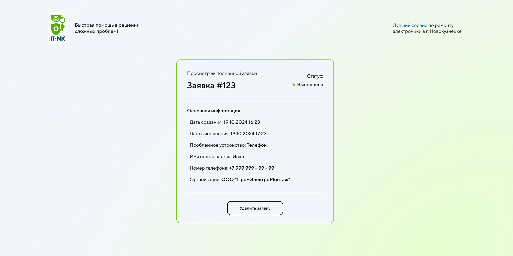

## Introduce

**Solving users' technical issues** is the primary task of a system administrator. The problem in this way is that, in most cases, there is no standardization or recording of the elements involved on this process.
Therefore, the application a modern approach to technical support for organizations of various sizes. Standardization of requests, with proper logging of ech technical assistance case, helps reduce service time for clients and provides an overview of the organization's infrastructure by tracking the number of requests.
The application is implemented as a website, so users can access ot from any device.
A created technical assistance request is sent to a Telegram group via a locally running [API for Telegram's bot](https://core.telegram.org/bots/api)

### Links
- [Backend part]()

## Technologies
- [Next.JS v14](https://nextjs.org/) + [TypeScript](https://www.typescriptlang.org/)
- [Axios](https://axios-http.com/docs/intro)
- [Redux-Toolkit](https://redux-toolkit.js.org/)
- [React-Dropzone](https://react-dropzone.js.org/)
- [Motion](https://motion.dev/docs)

## Getting Started

Clone project from GitHub and install packages:

```bash
npm i
npm audit fix # maybe after installing you must to run this
```

Then, run to build the project:

```bash
npm run dev
# or
yarn dev
# or
pnpm dev
# or
bun dev
```
After building start the project:

```bash
npm run start
# or
yarn start
# or
pnpm start
# or
bun start
```

Open [http://localhost:3030](http://localhost:3030) with your browser to see the application. **Make sure that the backend part of the app has already been started**. You can't use app without the backend part.

## Application pages

There are only two pages:
- Page for user to create a assistance request
- Page for operator to complete request

### Root page

On this page user creates  


#### Photo editor


### Operator's page



### Not found page


