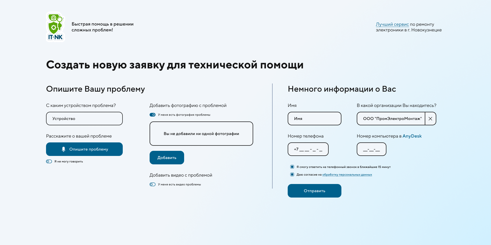
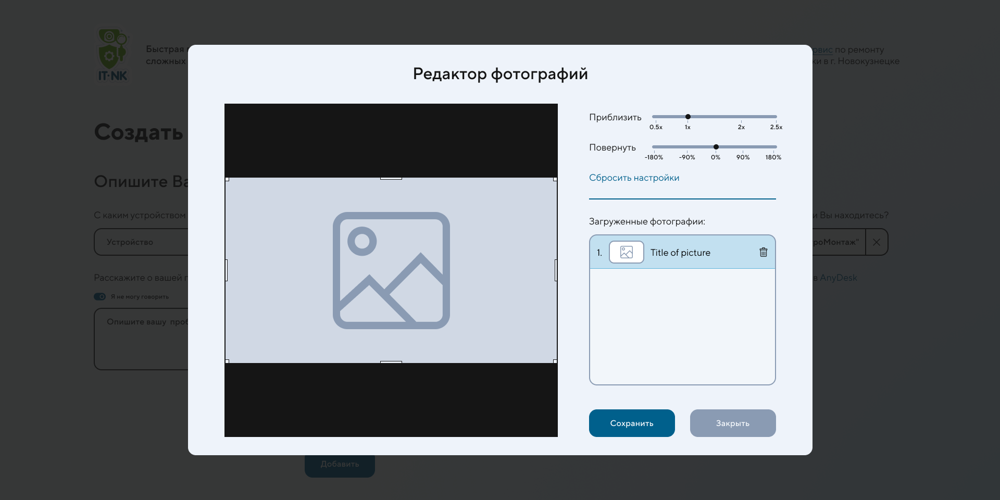
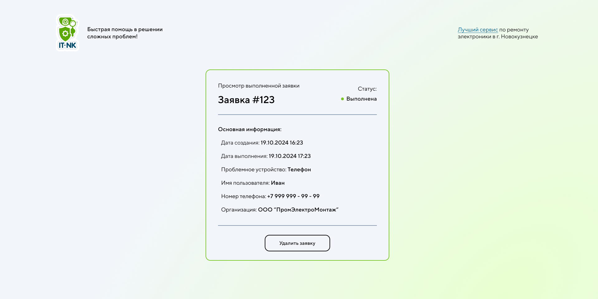
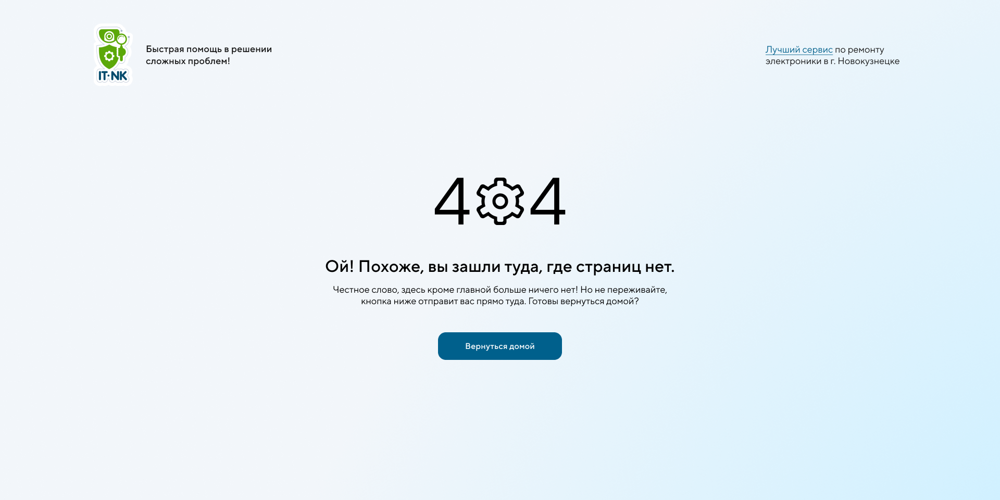

## Introduction

**Solving users' technical issues** is the primary task of a system administrator. The problem is that, in most cases, there is no standardization or recording of the elements involved on this process.
Therefore, the application a modern approach to technical support for organizations of various sizes. Standardization of requests, with proper logging of ech technical assistance case, helps reduce service time for clients and provides an overview of the organization's infrastructure by tracking the number of requests.
The application is implemented as a website, so users can access ot from any device.
A created technical assistance request is sent to a Telegram group via a locally running [API for Telegram's bot](https://core.telegram.org/bots/api)

### Links
- [Backend part]()

## Technologies
- [Next.JS v14](https://nextjs.org/) + [TypeScript](https://www.typescriptlang.org/)
- [Axios](https://axios-http.com/docs/intro)
- [Redux-Toolkit](https://redux-toolkit.js.org/)
- [React-Dropzone](https://react-dropzone.js.org/)
- [Motion](https://motion.dev/docs)

## Getting Started

Clone project from GitHub and install packages:

```bash
npm i
npm audit fix # maybe after installing you must to run this
```

Then, run to build the project:

```bash
npm run dev
# or
yarn dev
# or
pnpm dev
# or
bun dev
```
After building start the project:

```bash
npm run start
# or
yarn start
# or
pnpm start
# or
bun start
```

Open [http://localhost:3030](http://localhost:3030) with your browser to see the application. **Make sure that the backend part of the app has already been started**. You can't use app without the backend part.

## Application pages

There are only two pages:
- *Page for user* to create a assistance request (localhost:3030)
- *Page for operator* to complete request (localhost:3030/[assistance request ID])

### Root page

On this page, users can create an assistance request.
The form consist of two parts:
- User describes his problem:
    - Device that cause the problem (required)
    - Description of the problem (required)
    - Photos of the problem (optional)
    - Videos of the problem (optional)
- User's contact info:
    - Username
    - User's phone
    - Organization the user belongs to
    - User's PC number in [AnyDesk](https://anydesk.com/en)

The user must also agree to the data processing policy of the application. Additionally, the user can indicate that they are available for a callback within 15 minutes after submitting the assistance request.



#### Photo editor

Users can not only upload photos of the problem but also edit them. The photo editor is simple yet useful.  
Photo editor functions:
- Scale photo - from 0.5x to 2.5x
- Rotate photo up to 360%
- Crop photo
- Delete photo

When the photo editor is opened, temporary settings are created for each photo. The user must click the "Save" button to apply these settings. If the user clicks the "Close" button, the temporary settings will be discarded.



### Operator's page
A unique URL is generated for each assistance request, attached to the request, and sent to Telegram. The unique URL consists of 43 characters and is only available in Telegram. When the operator follows the link, the status of the assistance request automatically changes to **completed**.

There are only two statuses for the request:
- In processing
- Completed

Operator can delete the assistance request if there is no any reason to keep it in database.



### Not found page

There is only one page for users and operators. If a user tries to access a non-existent path, they will see this template.


